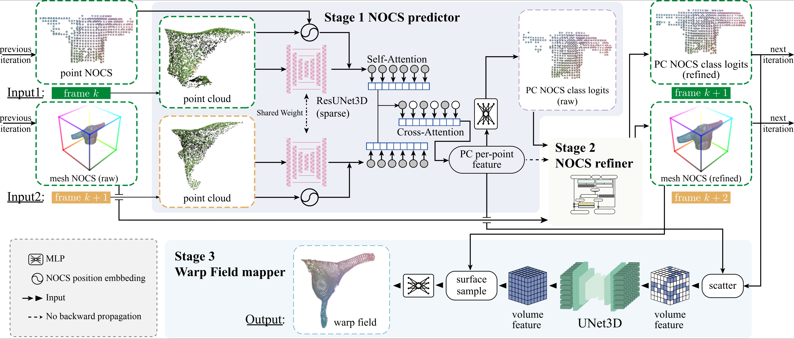

# GarmentTracking

This repository contains the source code for the paper [GarmentTracking: Category-Level Garment Pose Tracking](https://garment-tracking.robotflow.ai/). This paper has been accepted to CVPR 2023.



## Datasets

Please download [VR-Folding Dataset](https://huggingface.co/datasets/robotflow/vr-folding) from Hugging Face. All the data are stored in [zarr](https://zarr.readthedocs.io/en/stable/) format. You can put data under `%PROJECT_DIR/data` or any other location.

## Environment

### Requirements

- Python >= 3.8
- Pytorch >= 1.9.1
- CUDA >= 11.1

Please use the following commands to setup environments (we highly recommend installing Pytorch with pip for compatibility). The 3D feature extractor used in our paper is based on [MinkowskiEngine](https://github.com/NVIDIA/MinkowskiEngine).

```
conda create -n garment_tracking python=3.9
conda activate garment_tracking
```

```bash
pip install torch==1.12.0+cu113 torchvision==0.13.0+cu113 --extra-index-url https://download.pytorch.org/whl/cu113
```
```bash
conda install -y openblas-devel igl -c anaconda -c conda-forge
```

```bash
pip install -U git+https://github.com/NVIDIA/MinkowskiEngine -v --no-deps --install-option="--blas_include_dirs=${CONDA_PREFIX}/include" --install-option="--blas=openblas"
```
```bash
pip install torch-geometric torch-scatter torch_sparse torch_cluster torchmetrics==0.5.1 open3d pandas wandb pytorch-lightning==1.4.9 hydra-core scipy==1.7.0 scikit-image matplotlib zarr numcodecs tqdm dask numba
```


## Training

Here is the example for training ( `Tshirt`, `Folding` task):

```bash
python train_tracking.py datamodule.zarr_path=data/vr_folding_dataset.zarr/Tshirt logger.offline=False  logger.name=Tshirt-folding-tracking
```

Here `logger.offline=False` will enable online syncing (eg. losses, logs, visualization) for [wandb](wandb.ai). You can use offline syncing mode by setting`logger.offline=True`. You can set `datamodule.batch_size=8` if the GPU memory is not large enough.

Each running will create a new working directory (eg. `2022-11-03/12-33-00`) under `%PROJECT_DIR/outputs` which contains all the checkpoints and logs.

## Inference

Here are some examples for inference ( `Tshirt`, `Folding` task):

- First-frame initialization with GT:

```bash
python predict_tracking_gt.py datamodule.zarr_path=data/vr_folding_dataset.zarr/Tshirt prediction.max_refine_mesh_step=0 main.checkpoint_path=outputs/2022-11-03/12-33-00/checkpoints/last.ckpt logger.name=Tshirt-folding-tracking_test-gt
```

- First-frame initialization with noise:

```bash
python predict_tracking_noise.py datamodule.zarr_path=data/vr_folding_dataset.zarr/Tshirt prediction.max_refine_mesh_step=1 main.checkpoint_path=outputs/2022-11-03/12-33-00/checkpoints/last.ckpt  logger.name=Tshirt-folding-tracking_test-noise
```

For *Folding* task, we recommend using `prediction.max_refine_mesh_step=1`. For *Flattening* task, we recommend using `prediction.max_refine_mesh_step=15`.

## Evaluation

Here is the example for evaluation ( `Tshirt`, `Folding` task):

```bash
python eval_tracking.py main.prediction_output_dir=outputs/2022-11-07/14-48-52  logger.name=Tshirt-folding-tracking-base10_test-gt
```

The evaluation will also generate some visualization examples in the form of logs in [wandb](wandb.ai). You can set `logger.offline=False` if you want to enable automatic online syncing for [wandb](wandb.ai). You can also manually sync the logs later in offline mode by default.
